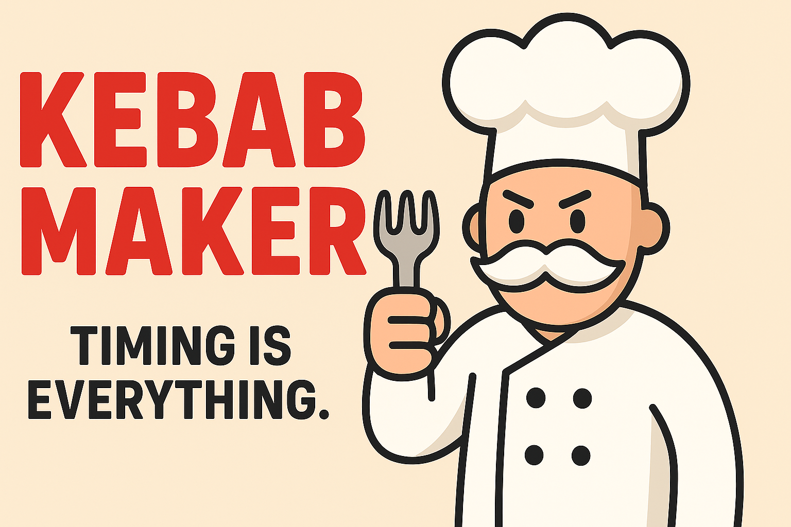

  

# Kebab Maker

**Timing is everything.**  
*Kebab Maker* is a fast-paced, mobile cooking game built with Unity where your job is to serve impatient customers as quickly and accurately as possible. Manage the chaos, deliver the right dishes, and grow your kitchen into a food empire.

---

## Gameplay

- Take the role of a single chef running the floor.
- Customers enter the restaurant, find open seats, and place orders.
- You must collect ingredients from cooking stations, prepare dishes, and deliver them before time runs out.
- Simple controls, increasingly demanding pace.
- Concentration and timing are key — can you keep up?

---

## Features

- Dynamic customer flow with seat selection  
- Cooking stations with unique ingredient handling  
- Order generation system  
- Dish preparation and delivery mechanics  
- Visual feedback for completed orders  
- Optimized for mobile screens and touch-based gameplay  
- Built in Unity using C#

---

## Tech Stack

- **Engine:** Unity (URP)  
- **Language:** C#  
- **Tools:** Unity Animator, ScriptableObjects, UI Toolkit  
- **Platform:** Mobile (Portrait orientation)

---

## Screenshots

  
  
  

---

## Future Plans

- Progression system (earnings, upgrades)  
- Multiple restaurant layouts  
- New ingredients, recipes, and dish types  
- Visual polish and animations  
- Audio and sound design  
- Android build & release

